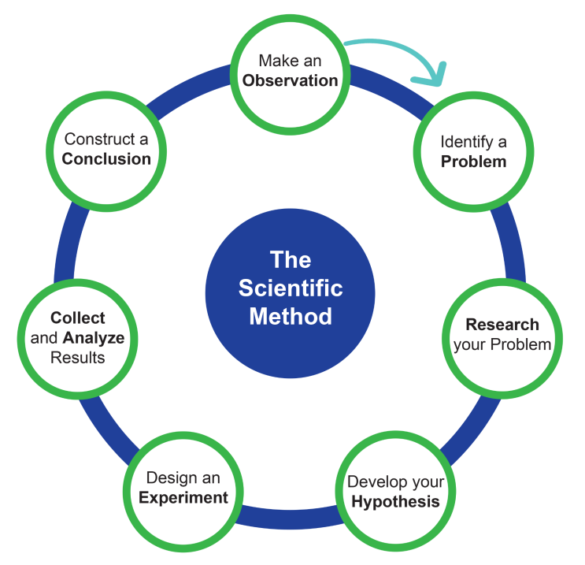
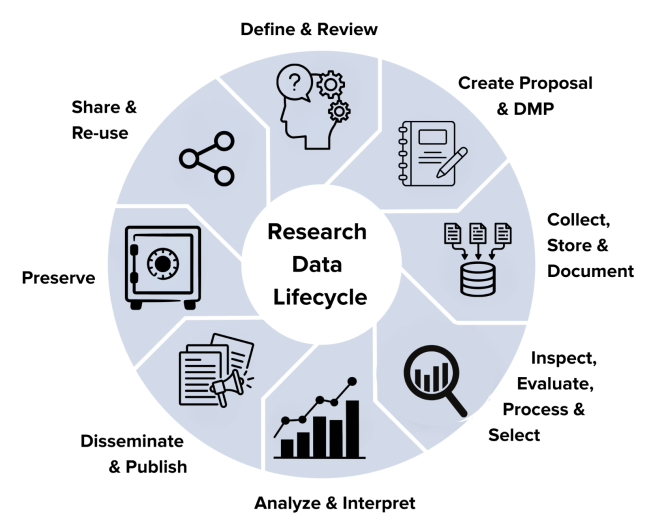

## Define research - Quick Write

```{r}
#| echo: false
countdown::countdown(minutes = 1, seconds = 0, warn_when = 15, 
                     right = "05%", top = "10%",
                     blink_colon = TRUE,
                     play_sound = "audio/smb_coin.wav",
                     id = "special_timer")
```

::: {.center-xy}

[In one sentence, <br></br> ***what is the most important aspect of research?***]{style="font-size: 2em;" .fragment}

:::

## Research is guided by a question

:::{.columns}

::::{.column}



::::

::::{.column .incremental}

- Inciting curiosity in something
- Define a ***research question*** to explore
- Communicate results in a scientific article

::::

:::

::: {.notes}
What is the common denominator of each step?

"What is the research question?"
:::

## The simple structure a research question

:::{.incremental}

- A research question is [a complex sentence](https://owl.purdue.edu/owl/graduate_writing/introduction_to_writing/documents/revising-and-editing/sentence-structure-activity.pdf){target="_blank"} containing:

  - a subject,
  - an independent clause, (a complete thought)
  - and a dependant clause (an incomplete thought)


- A clause constitutes:
  - a subject
  - a verb

:::

## Step 1: Identify a Research Qustion

::: {.columns}

::::{.column}

- What is the Research Question?
  - Research Subject (RS): _______
  - Independent Variable (IV): _______
  - Dependent Variable (DV): _______

Example question: ~~How can we stop malaria?~~

::::

::::{.column}

:::{.incremental}

- Can the pathogenic protozoa be eliminated from within a mosquito by gene drive methods?
  - mosquito (vector of malaria)
  - gene drive methods
  - pathogenic protozoa population

:::

::::

:::

## Step 2: If-Then-Because

- A hypothesis can be as simple as sequentially using **If-Then-Because**
  - IF = RS + IV
  - THEN = DV
  - Because = Reasoning and context

| IF | THEN | BECAUSE|
|:---|:---:|---:|
| If gene-drive mosquitos are released in the wild | Then the pathogenic protozoa population will be eliminated | because the gene drive methods beneficially selects gene-drive mosquitos for breeding and uses two separate protozoan targets to eliminate protozoa in mosquitos. |

## Define research - Quick Write

```{r}
#| echo: false
countdown::countdown(minutes = 10, seconds = 0, warn_when = 15, 
                     right = "05%", top = "10%",
                     blink_colon = TRUE,
                     play_sound = "audio/smb_coin.wav",
                     id = "special_timer")
```

::: {.center-xy}

- What is the Research Question?
  - Research Subject (RS): _______
  - Independent Variable (IV): _______
  - Dependent Variable (DV): _______

- A hypothesis can be as simple as sequentially using **If-Then-Because**
  - IF = RS + IV
  - THEN = DV
  - Because = Reasoning and context


:::

## Research begins and ends with a **question**

:::{.incremental}

- And requires **reproducibility**
  - Ability to repeat the same analysis with the same data and get the same result.

:::

{fig-align="center" fig-alt="The life cycle of research." width=20%}


## Tabular Data Structure

:::{.columns}

::::{.column}

- Each column is a variable (a feature of the research question)
- Each row is an observation (a single data collection event)

::::

::::{.column}

```{R}
library(gt)
library(tibble)

# 1. Create data with 4 rows and an explicit row number column
blank_data <- tibble(
  row_id   = as.character(1:4), # This will become our row numbers
  Column_1 = rep("", 4),
  Column_2 = rep("", 4),
  Column_3 = rep("", 4),
  Column_4 = rep("", 4)
)

# 2. Pass to gt in a single, smooth pipeline
final_table <- gt(blank_data, rowname_col = "row_id") |> 
  tab_header(
    title = "Table",
    subtitle = "Empty of data"
  ) |> 
  tab_source_note(
    source_note = "No data available for the current selection." )|>
  tab_options(
    table_body.vlines.style = "solid",
    table_body.vlines.color = "#D3D3D3",
    table_body.vlines.width = px(1),
    column_labels.vlines.style = "solid",
    column_labels.vlines.color = "#D3D3D3",
    column_labels.vlines.width = px(1)
  )

# Display the table
final_table
```

::::

:::

## Data Types

:::{.columns}

::::{.column}

- There are standard atomic variables in R
- Dates are an example of additional data types:
  - `r as.Date(c("2026-01-01", "2026-04-15", "2026-08-22", "2026-12-25"))`

::::

::::{.column}

```{R}
library(gt)
library(tibble)

# 1. Create data with 4 rows showing standard R data types
type_data <- tibble(
  row_id = as.character(1:4), 
  String = c("Hello", "Hi", "hi", "Morning"),
  Int    = c(1L, 3L, 5L, 100L), # 'L' forces R to store these as true Integers
  Flt    = c(0.35, 0.5, 1.03, 2.14),
  Bool   = c(TRUE, FALSE, TRUE, TRUE)
)

# 2. Pass to gt in a single, smooth pipeline
final_table <- gt(type_data, rowname_col = "row_id") |> 
  tab_header(
    title = "Standard Data Types in R",
    subtitle = "A demonstration of Character, Integer, Double, and Logical types"
  ) |> 
  tab_source_note(
    source_note = "Data types mapped using standard R vectors."
  ) |>
  tab_options(
    table_body.vlines.style = "solid",
    table_body.vlines.color = "#D3D3D3",
    table_body.vlines.width = px(1),
    column_labels.vlines.style = "solid",
    column_labels.vlines.color = "#D3D3D3",
    column_labels.vlines.width = px(1)
  )

# Display the table
final_table
```

::::

:::

## Metadata

:::{.columns}

::::{.column}

- Information about the data
  - Project READMEs are high-level overviews of the project
  - Workflow diagrams are depictions of the processes within a project
  - Data dictionaries are categorized observations ABOUT the data
  - Data biographies are short, descriptive narrative about the who, what, where, when, why of a dataset.
    - Used to expose biases within the data!

::::

::::{.column}

```{R}
library(gt)
library(tibble)

# 1. Create data with 4 rows showing standard R data types
type_data <- tibble(
  row_id = as.character(1:4), 
  greeting_used = c("Hello", "Hi", "hi", "Morning"),
  count    = c(1L, 3L, 5L, 100L), # 'L' forces R to store these as true Integers
  norm_count    = c(0.35, 0.5, 1.03, 2.14),
  presented_w_smile   = c(TRUE, FALSE, TRUE, TRUE)
)

# 2. Pass to gt in a single, smooth pipeline
final_table <- gt(type_data, rowname_col = "row_id") |> 
  tab_header(
    title = "Typical dataframe in R",
    subtitle = "A demonstration of metadata"
  ) |> 
  tab_source_note(
    source_note = "The datatypes are still here too!"
  ) |>
  tab_options(
    table_body.vlines.style = "solid",
    table_body.vlines.color = "#D3D3D3",
    table_body.vlines.width = px(1),
    column_labels.vlines.style = "solid",
    column_labels.vlines.color = "#D3D3D3",
    column_labels.vlines.width = px(1)
  )

# Display the table
final_table
```

::::

:::

## Ethical ramification of Data and Metadata

- Atenas et al. 2023 did a literature review to develop an 8-item ethics framework:
  - Respect autonomy
  - Respect privacy
  - Promote fairness
  - Address equality
  - Do no harm
  - Promote sovereignty
  - Address bias
  - Challenge power structures

:::{.center-xy}

[Reframing data ethics in research methods education: a pathway to critical data literacy](doi.org/10.1186/s41239-023-00380-y)

:::
